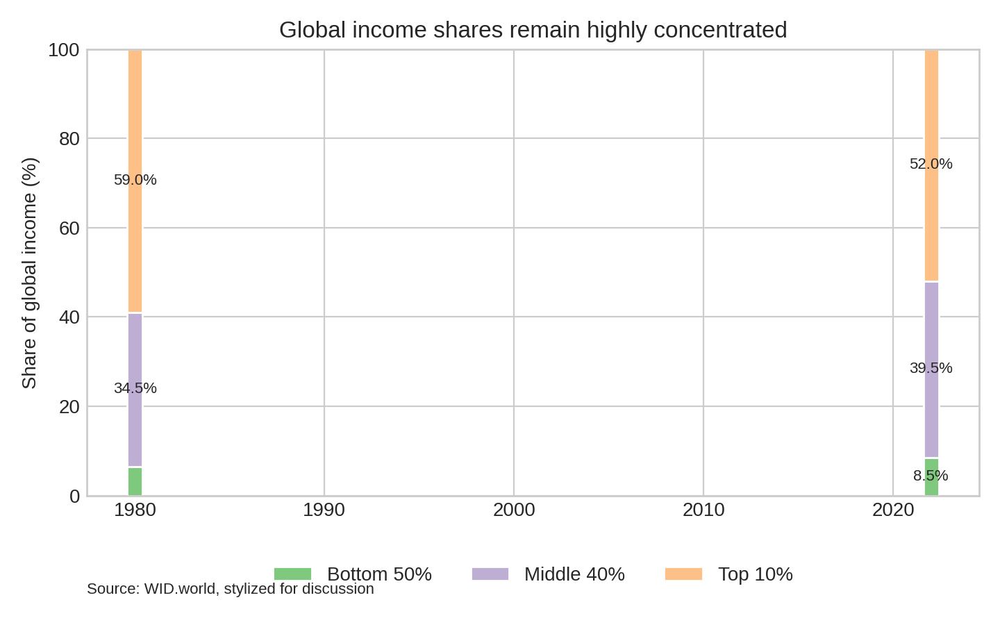
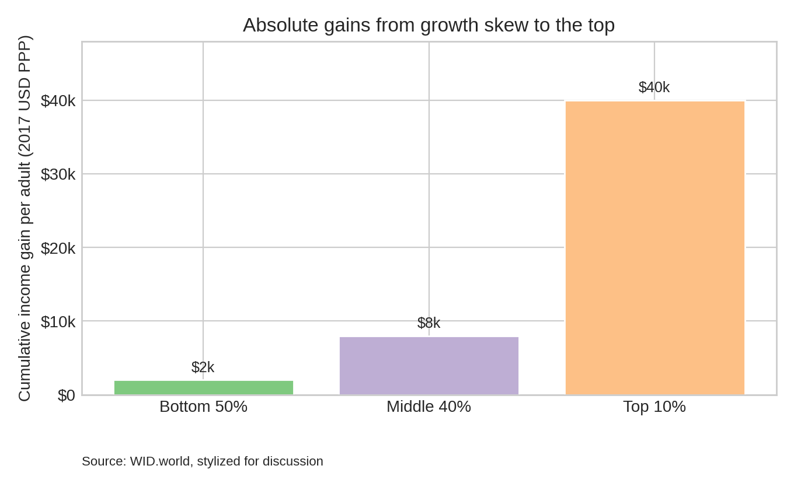

# Oxfam Conference: Trends in Global Income

## Slide 1. Title

**Trends in Global Income Inequality**  
Story in two figures for donor discussion

---

## Slide 2. Who gets global income?

**Key point:** Even after decades of growth, the top 10% still take about half of global income.  
The bottom 50% receive less than 1 in 10 dollars worldwide.

**Discussion prompt:** If global growth continues, what would it take for the bottom half to double its share?

---

## Slide 3. Who captured the gains?

**Key point:** Absolute gains from growth are dramatically larger at the top.  
This gap widens perceptions of unfairness, even when poverty falls.

**Discussion prompt:** Should policy focus on faster growth at the bottom, or on limiting outsized gains at the top?

---

## Slide 4. Implications for donors

- **Inequality is sticky.** Growth alone has not shifted income shares quickly.
- **Perception matters.** Large absolute gaps can fuel political and social instability.
- **Leverage points.** Investments that raise bottom-half earnings (jobs, education, basic services)
  can be paired with fair-tax initiatives to rebalance gains.

**Ask:** Which interventions are most credible at moving income shares, not just incomes?

---

### Data note

Figures use stylized values based on public summaries (e.g., WID.world) for discussion.
Replace with the latest official data before final submission.
